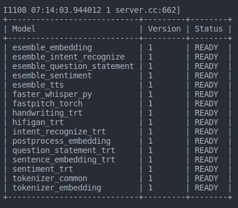

# Triton Serving for AI Model

In this repo, we will provide sources and guides for production model AI through TensorRt and [Triton Serving](https://developer.nvidia.com/tensorrt).

* Overview step by step to serve a model by Triton. 


## Make custom requirements 

Triton supports some platforms to bring your AI model to production with high performance, such as Torch, TensorFlow, TensorRT, Onnx, and Pure Python.

In some cases, if you want to run your code with pure Python, some third-party libraries are required. You should create a custom base image.

### Build custom base image

Base images base on nvidia-triton-serving image, but change a bit requirements while wanting to use pure Python with default others.

I attached a Dockerfile to build a custom base image with requirements.txt. 

To build a base image, please insert your libraries into requirements.txt. Don't forget to define the version.

```sh
   docker build . -t <image_name>:<image_tag>
```

Note: You can change the image name and image tag in <image_name>:<image_tag>. 

### Converting model

You can use any framework to develop your model, such as TensorFlow, Python, etc. But the pure framework is quite slow in production. So I strongly recommend converting to another format, such as ONNX or TensorRT.

You can use any framework to develop your model, such as TensorFlow, Python, etc. But the pure framework is quite slow in production. So I strongly recommend converting to another format, such as ONNX or TensorRT.
While converting, you can set fp16 mode or int8 to speed up inference time. But let's remember that you need to check again about the precision of the model after that was converted.

Two common cases:

+ ONNX with fp16 or fp32

+ TensorRT: fp16, fp32 or int8

##### 1. Installation

If you want to install the TensorRT environment on your local machine, you can follow the [instructions](https://docs.nvidia.com/deeplearning/tensorrt/install-guide/index.html) or [documents](https://docs.nvidia.com/deeplearning/tensorrt/archives/tensorrt-700/pdf/TensorRT-Installation-Guide.pdf)

You can face some issues when installing on a local machine. You can check again about the version.
Another way is that it is easy to use and rapid to setup. Docker is a wonderful solution to address any problems related to installation.

```sh
   docker run -d  --gpus all -it --rm -v ./:/workspace  nvcr.io/nvidia/tensorrt:23.09-py3
```

To finish setting up Triton with Docker, follow the command below. You need to map your workspace in host machine into Docker workspace by argument -v.

The NVIDIA team was exposed to a stage for converting the model from deep learning frameworks to inference frameworks. 


##### 2. Converting to ONNX

The entire model should be converted to ONNX before being transferred to TensorRT. You can follow 2 instructions bellow to convert your model.

+ Tensorflow, pls use this [guide](https://github.com/onnx/tensorflow-onnx)

+ Torch with this [guide](https://pytorch.org/tutorials/beginner/onnx/export_simple_model_to_onnx_tutorial.html)

+ Others: Google is always ready for use.

The Monkey's ONNX model was saved at S3: data-team-media-ai/model-zoo/onnx_model_zoo/

Some examples to convert model torch and another frameworks was putted in 'jupyter_notebook'

Almost torch model can convert to ONNX by command below (don't forget pre-install onnx and torch):

```sh
# export
import torch
torch.onnx.export(
    
    sentiment_model, 
    tuple(inputs.values()),
    f="sentiment-model.onnx",  
    input_names=['input_ids', 'attention_mask'], 
    output_names=['logits'], 
    dynamic_axes={'input_ids': {0: 'batch_size', 1: 'sequence'}, 
                  'attention_mask': {0: 'batch_size', 1: 'sequence'}, 
                  'logits': {0: 'batch_size', 1: 'sequence'}}, 
    do_constant_folding=True, 
    opset_version=17, 
)
```
You must to understand input and output of the model. 

Note:

✅ Nếu chạy trên GPU với TensorRT → Dùng Opset 13 hoặc 14 để tận dụng FP16 tốt hơn.

✅ Nếu chỉ chạy trên ONNX Runtime (CPU/GPU) → Opset 14+ giúp inference nhanh hơn.

✅ Nếu cần đảm bảo tương thích cũ (ONNX 1.6 trở xuống) → Dùng Opset 11 hoặc 12.

##### 2. Converting to TensorRT

I used Docker to convert my model to TensorRT, you can refer my command bellow:

```sh
   trtexec --onnx=models/openai/whisper-small/onnx/whisper-small-encoder.onnx --saveEngine='model.engine' --explicitBatch --workspace=1024
```

+ ONNX: path of the model ONNX

+ saveEngine: path of TensorRT model

+ explicitBatch: This option will allow for a fixed batch size.

+ workspace: the value allows to set maximum memory for each layer in model 

If you want to run fp16, or int8 add argument into the command as:

```sh
   trtexec --onnx=onnx/handwriting/1/model.onnx --saveEngine='model.engine' --explicitBatch --workspace=1024 --fp16
```

If you want to set dynamic axis for TensorRT model:

* Example for Wav2Vec
```sh
trtexec --onnx=wav2vec2-xls-r-300m-phoneme-monkey-v2-fix16k.onnx --saveEngine='model.engine' --minShapes=input:1x100000 --optShapes=input:1x100000 --maxShapes=input:5x100000 --fp16 
```

* Example for Sentence Transformer
```sh
trtexec --onnx=onnx/sentence_transformer/all-mpnet-base-v2.onnx --saveEngine='model.engine' --minShapes=input_ids:1x1,attention_mask:1x1 --optShapes=input_ids:1x15,attention_mask:1x15 --maxShapes=input_ids:1x384,attention_mask:1x384
```

In some situations, we are able must to fix the shape of the model.

```sh
trtexec --onnx=onnx/wav2vec/wav2vec2-xls-r-300m-phoneme-monkey-v2-fp32.onnx --saveEngine='model.engine' --shapes=input:1x100000 --explicitBatch --fp16
```

Attention:

- While my trying time, i have considered that, the shape should be fixed to improve performance in some situation that, the model TensorRT is slower than original model. We also don't should set up the model with large dynamic shape range. 


Note: We can export any name you want, but to identify the model, it is a TensorRT model or not. We should set the file extension to one in three [.plan, .trt, .engine]. But Triton only can see .plan file. 

## Serving Triton 

After converting the model to TensorRT format, We can bring them to our production through Triton Serving.

Some steps to apply them to products:

* Create a model_repository

This folder will be used to covert entire your model. 

```
model_repository
|
+-- handwriting
    |
    +-- config.pbtxt
    +-- 1
        |
        +-- model.onnx
```

* Define the model config inside config.pbtxt:  

```
name: "handwriting"
platform: "onnxruntime_onnx"
max_batch_size : 32

input [
  {
    name: "input_1"
    data_type: TYPE_FP32
    format: FORMAT_NHWC
    dims: [ 128, 128, 3 ]
    reshape { shape: [128, 128, 3 ] }
  }
]
output [
  {
    name: "dense_1"
    data_type: TYPE_FP32
    dims: [ 26 ]
    reshape { shape: [ 26] }
    label_filename: "labels.txt"
  }
]

```

You can see type data was allowed in below image:


name: model name, it is the name of the folder too.
platform: env to run your model [onnxruntime_onnx, tensorrt_plan, torch, ...]
max_batch_size: maximum batch size of the model
input: define the input of API 
output: define the structure of response

```diff
- Note: Input and Output shape will without batch-size. 
```

In a model_repository, you can define many sub-folders; it is equivalent to a model.

After converting the model, don't forget upload to S3:

```sh
aws  s3  sync  model_repository   s3://data-team-media-ai/model-zoo/mspeak-v3/
```

If you want to download from S3: 

```sh
aws  s3  sync  s3://data-team-media-ai/model-zoo/mspeak-v3/ model_repository
```

* Serving

To use easily, you should to create a docker-network before starting server.

```sh
docker network create mspeak-network
```
mspeak-network is name of network, you can change anytime depend on you.

```sh
docker run --network mspeak-network --gpus all --shm-size=2g --ulimit memlock=-1 --ulimit stack=67108864 -p8000:8000 -p8001:8001 -p8002:8002 -v/home/monkey/edu_ai_triton_serving/model_repository:/models trunghoang12/monkey-python-base:triton-23.09-py3-v2 tritonserver --model-repository=/models
```


Note: Some requirements about the device to run Triton

* A Nvidia GPU was installed.
* Docker and Docker-compose
* [Nvidia Container Toolkit] (https://docs.nvidia.com/datacenter/cloud-native/container-toolkit/latest/install-guide.html)
* Host folder contains model: /home/monkey/edu_ai_triton_serving/model_repository
* Base image: trunghoang12/monkey-python-base:triton-23.09-py3-v2

Completing start serving you can see a table look like:



## Testing

Triton provides both protocols: GRPC (8001) and HTTP (8000).  

[Postman documents](docs/TensorRT.postman_collection.json)

To optimize for latency. I suggest you use Grpc to enhance performance with delay 20ms in almost my cases, you can try do it through [triton-client](https://github.com/triton-inference-server/client).


Additionally, Triton serving provide a API to help display metrics system at curl ```http://127.0.0.1:8002/metrics```

* TYPE nv_inference_request_success counter

nv_inference_request_success{model="wav2vec_torch",version="1"} 1473
nv_inference_request_success{model="silero_vad",version="1"} 90321

* TYPE nv_inference_request_failure counter 

... 

Read more [information](https://docs.nvidia.com/deeplearning/triton-inference-server/user-guide/docs/user_guide/metrics.html)

## Benchmark API from Triton 

We can benchmark model, that was started up by Triton by [Apache Benchmark tool](https://httpd.apache.org/docs/2.4/programs/ab.html). 

```sh
ab -p data_samples/body_bm_wav2vec/body_w2v_v4.txt -T application/json  -c 100 -n 1000 http://localhost:8000/v2/models/wav2vec_trt/infer
```

+ data_samples/body_bm_wav2vec/bm_w2v.txt: The file contains body of request. It has json format but it saved into a .txt file.
+ -c: concurrency requests.
+ -n: number of requests will be used.

Some sample data in folder: data_samples

Result:


## Interageting with Triton

Triton provides a client to interact with Triton. You can use it to test your model.

Install triton client: ```pip install tritonclient[all]```

## Others 

We will have some models containing so many steps such as LLM or TT2. They are set of some models wrapping into a end-to-end model. 

Unfortunately, Some of model don't support TensorRT format, so we only run by Python backend. We also need to separate and define them into independent model.

Triton also provides a ensemble model to combine models. You can look some samples: "esemble_embedding"
